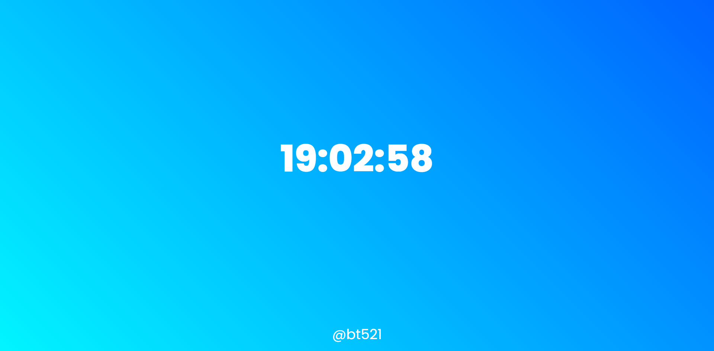

# Javascript-Clock-Project

This is a small project I made that displays the digital time using vanilla JavaScript. It displays the time based on the current time of the user

**[link](https://bt521.github.io/javascript-clock-project/)**

# Future Plans

I plan on adding some cool things like:

- 12hr clock version
- An analogue clock
- add a date feature
- World Clock feature
